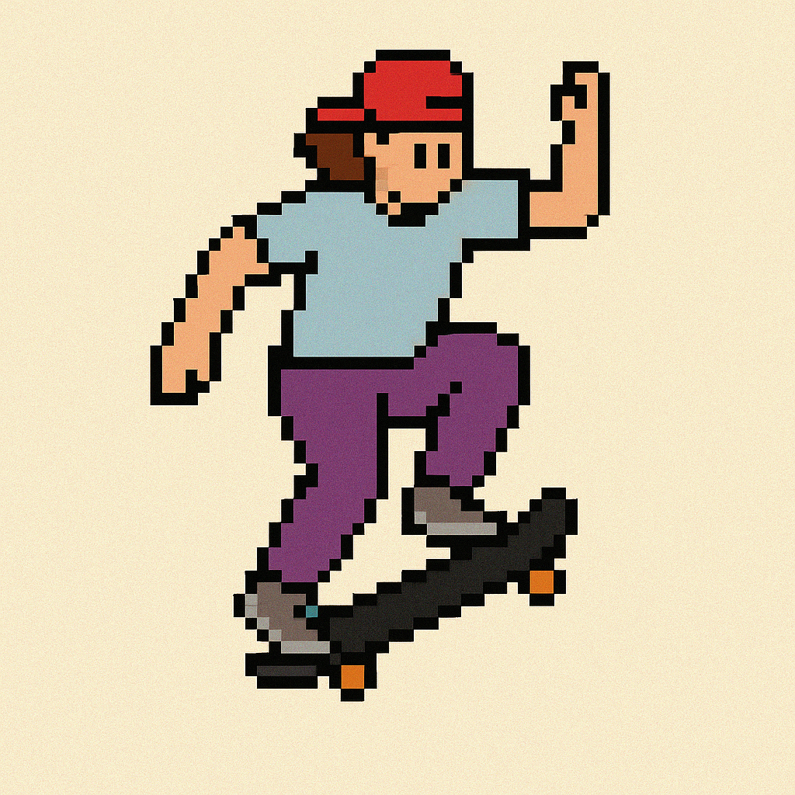

# 🛹 Skate Clash: Battle of Tricks!
A Text-Based Skateboarding Competition Game  


## 🎮 How to Play
Compete in a 1v1 trick battle across three rounds:  
1. **Qualifier**  
2. **Group Stage**  
3. **Grand Final**

Each turn, you select a trick from your available list.  
Each trick has its own:
- **Base Score**  
- **Success Rate**  
- **Risk of Injury**

Outscore your AI opponent to win each round. Survive all 3 rounds to win the championship!


## ▶️ How to Play
Run: game.py

## Sample Run

```text
🏁 Welcome to Skate Clash: Battle of Tricks!
Enter your skater name: Slow Sam
Round 1: Qualifier

Your available tricks:
1. Ollie - Score: 20, Success Rate: 95%, Risk: 0%
2. Manual - Score: 15, Success Rate: 90%, Risk: 5%
3. Shuvit - Score: 25, Success Rate: 85%, Risk: 5%
4. Pop Shuvit - Score: 30, Success Rate: 80%, Risk: 10%

Pick your trick (e.g. Ollie): Pop Shuvit
🎯 Trick succeeded! You scored 28.5 points.
✅ You avoided injury. Health: ❤❤❤

----------------------------------------
Casual Chloe’s turn:
🎯 Chloe performed ‘Shuvit’ - Success: True, Score: 23.8
✅ Casual Chloe avoided damage. Health: ❤❤❤

==> End of Round 1
Winner: Slow Sam 🏆
Current Health: ❤❤❤
Total Score: 28.5 vs 23.8

Advance to Round 2? (y/n): y
...